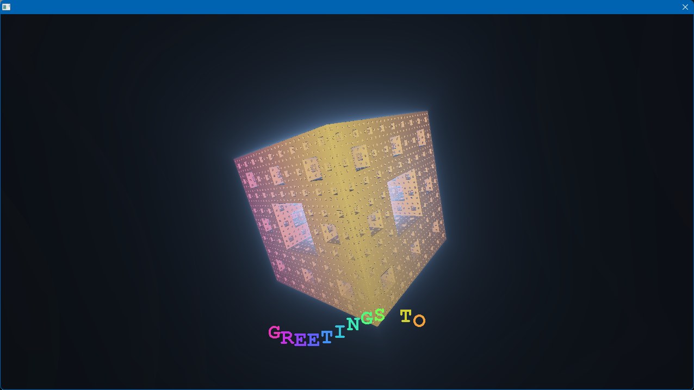

# 4KB

A 4k intro for Windows, **2420 bytes** binary.



A Menger sponge tumbles in space with light leaking from its core; the camera
dives into it on the bar-8 downbeat and the gyroid-carved tunnel inside turns
out to be its innards. 140 BPM techno (four-on-the-floor kick, offbeat hats,
acid bassline through a resonant filter), sine-wobbler rainbow greetings, and
kick-synced screen flashes. Everything loops every 16 bars (~27 s). ESC quits.

## How it fits in 4k

- Single fullscreen fragment shader (raymarched, both scenes in one `map()`),
  minified at build time by Shader Minifier and compiled via
  `glCreateShaderProgramv`
- Music is synthesized into a buffer at startup and looped via `waveOut`:
  integer phase accumulators for oscillators, parabolic sine for the kick,
  LCG noise for hats, Chamberlin SVF for the acid squelch — no `sin`, no `pow`
- The intro clock is `waveOutGetPosition`, so visuals, greets, and flashes are
  sample-locked to the music
- Greetings text comes from a GDI font baked into GL display lists with
  `wglUseFontBitmaps` — the strings are the only bytes paid for
- Compiled x86 with MSVC, linked and compressed with Crinkler

## Building

Requirements: Visual Studio 2022 (x86 toolchain), plus two tools in `tools/`
(not committed):

- [Crinkler 2.3](https://github.com/runestubbe/Crinkler/releases) →
  `tools/crinkler/crinkler23/Win64/Crinkler.exe`
- [Shader Minifier](https://github.com/laurentlb/shader-minifier/releases) →
  `tools/shader_minifier.exe`

From an **x86** Native Tools Command Prompt (or after
`call "...\VC\Auxiliary\Build\vcvarsall.bat" x86` — Crinkler outputs 32-bit
PEs, so the 64-bit toolchain won't do):

```bat
tools\shader_minifier.exe -o shader.h --format c-variables shader.frag

cl /c /O1 /Os /Oi /GS- /Gy /fp:fast /QIfist /arch:IA32 main.c

tools\crinkler\crinkler23\Win64\Crinkler.exe /ENTRY:entrypoint /SUBSYSTEM:WINDOWS ^
    /COMPMODE:SLOW /ORDERTRIES:4000 /UNSAFEIMPORT /REPORT:report.html ^
    /OUT:intro.exe main.obj kernel32.lib user32.lib gdi32.lib opengl32.lib winmm.lib
```

This minifies `shader.frag` into `shader.h`, compiles `main.c` without the
CRT, and Crinkler-links the compressed `intro.exe`, printing the byte count.
(`/QIfist` matters: without it, float-to-int casts call a CRT helper that
isn't there.)
